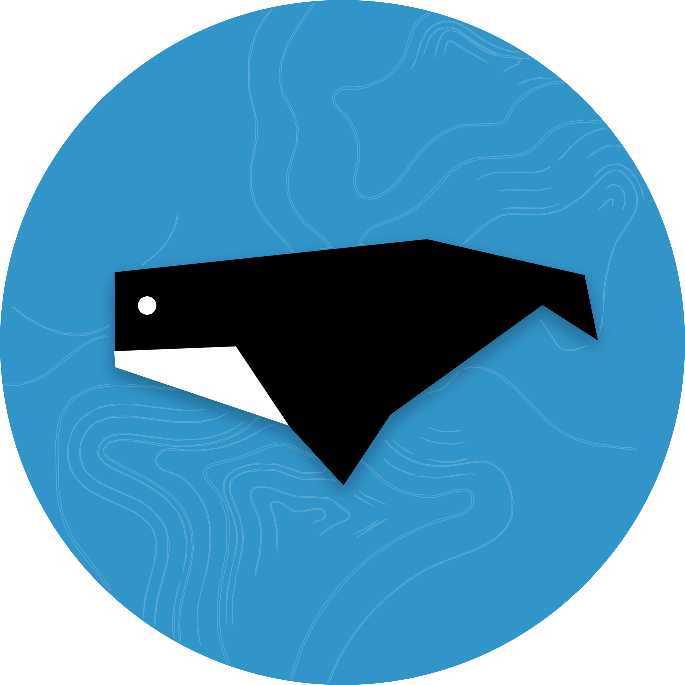

<div align="center">



# Carbon & Whale · IMS

###Inventory Management System

_A role-governed operational platform designed for high-density transit metro
networks and retail advertising inventory._

[](https://react.dev/)
[](https://vitejs.dev/)
[](https://tailwindcss.com/)
[](https://supabase.com/)

---

</div>

## 📌 Overview

**Carbon & Whale IMS** provides a unified operational dashboard for transit
metro and retail out-of-home (OOH) media networks. It streamlines the
advertising asset lifecycle:

- **Asset Registry & Rate Cards**: Real-time tracking of dimensions,
  illumination, locations, and pricing.
- **Interest Queue & Priority Timers**: Transparent queue slots with automated
  working-day expiry engines.
- **Campaign Execution Flow**: Structured progression from _Draft_ &rarr;
  _Onboarding_ &rarr; _GTP Review_ &rarr; _Live_.
- **Geo-Tagged Proof (GTP)**: Field operations photo uploads with geolocation
  and timestamp verification.
- **Role-Based Access Control (RBAC)**: Distinct permissions for Sales,
  Operations, Finance, Finance Manager, and Admin.
- **Immutable Audit Trail**: Append-only activity ledger recording all status
  changes, approvals, and queue updates.

---

## 🏗️ Tech Stack

- **Frontend**: [React 19](https://react.dev/) + [Vite](https://vitejs.dev/)
- **Styling**: [Tailwind CSS](https://tailwindcss.com/) +
  [shadcn/ui](https://ui.shadcn.com/)
- **Data & State**: [@tanstack/react-query](https://tanstack.com/query/latest)
- **Routing**: [React Router DOM](https://reactrouter.com/)
- **Icons**: [Lucide React](https://lucide.dev/)
- **Backend / Database**: [Supabase](https://supabase.com/) (PostgreSQL with Row
  Level Security)

---

## ⚡ Getting Started

### 1. Prerequisites

- **Node.js**: v18.0.0 or higher
- **npm** or **yarn**

### 2. Environment Configuration

Create a `.env` file inside the `frontend/` directory:

```env
VITE_SUPABASE_URL=https://your-project.supabase.co
VITE_SUPABASE_ANON_KEY=your-supabase-anon-key
```

### 3. Installation & Local Development

```bash
# Navigate to the frontend directory
cd frontend

# Install dependencies
npm install

# Start the development server
npm run dev
```

Open your browser and navigate to `http://localhost:3000` (or the port specified
in terminal).

---


## 📁 Project Structure

```
├── frontend/
│   ├── public/
│   │   └── brand/               # Brand vectors, icons, and logos
│   ├── src/
│   │   ├── components/          # Reusable UI primitives, skeletons, and layouts
│   │   ├── lib/                 # Supabase client, queries, and auth helpers
│   │   ├── pages/               # Screen views (Dashboard, Assets, Queue, Campaigns, etc.)
│   │   ├── App.jsx              # Main routing configuration
│   │   ├── index.css            # Tailwind & custom animation styles
│   │   └── main.jsx             # React entry point
│   └── package.json
├── README.md
└── vercel.json                  # Deployment routing configuration
```

---

## 📄 License & Brand Notice

© **Carbon & Whale**. All rights reserved.\
Proprietary software for transit and retail Out-Of-Home media operations.
